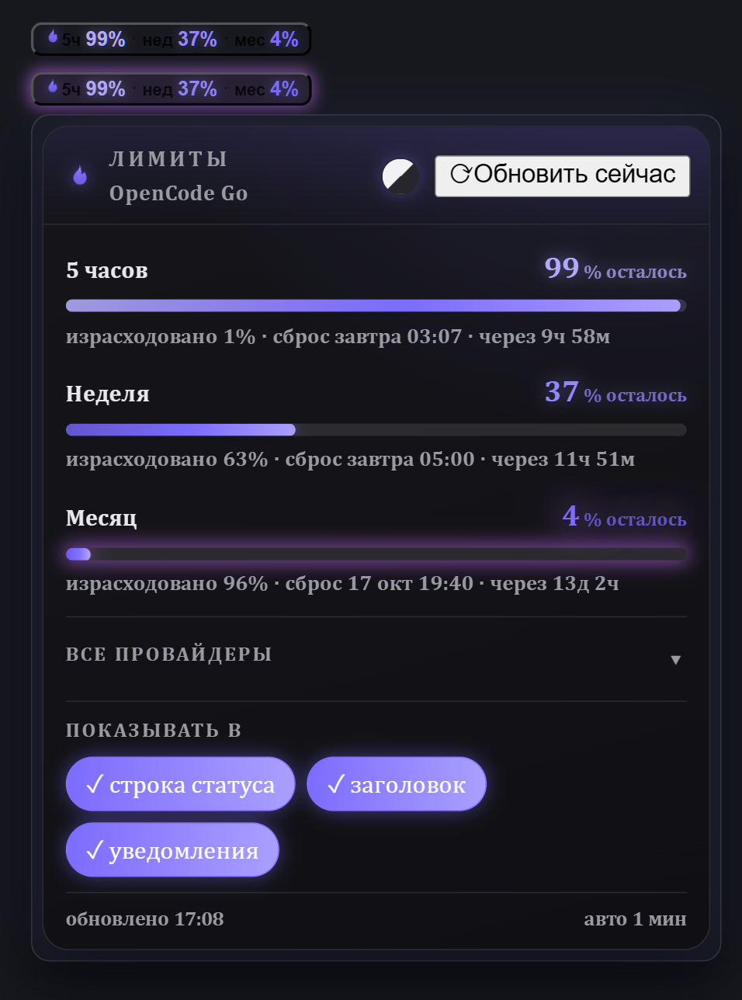

# 🔥 Usage Flame

**Live subscription-limit windows for Hermes Desktop — as a pinned, glowing chip and a fire-themed panel.**

[](LICENSE)




You pay for AI subscriptions with quota windows — 5 hours, a week, a month. Hermes already knows the numbers (`hermes usage`); **Usage Flame keeps them always in sight**: a compact chip that never leaves your status bar, one click away from the full picture.

## Features

- **🧩 Pinned chip** — status bar and/or title bar, both toggleable; at least one chip always stays. Collapsed it fits in a single line; when any window drops to **≤10%** it turns fiery — animated glow plus countdown.
- **🔥 Panel** — click the chip for per-window detail. Windows are rendered **exactly as the provider reports them** — no assumptions about 5h/week/month; whatever set exists is shown as-is.
- **📈 Pace & forecast** — burn rate (%/h) computed from local usage history: *«темп 0.3%/ч · до сброса хватит»*, *«исчерпание ~18:40»*, or *«без изменений»* when flat — with a sparkline of the window's history.
- **🌐 All providers** — expandable list with remaining numbers per provider; providers without data are honestly marked *«нет данных»*.
- **🎨 Themes** — inherit the Hermes theme, or pick one of **12 color themes** (Fire, Neon, Aurora, Gold, Sakura, Ocean…) across 12 accent swatches; plus independent **font family and size** pickers. Every color is theme-aware and glows.
- **🔔 Notifications** — optional threshold alerts (≤10% remaining, once per window period).
- **🌍 RU / EN** — follows the app locale.
- **🛡 Honest states** — stale data flagged («≈» *«Нет свежих данных»*), friendly error/empty states, retry + dedup, 10-minute caching so CLI spawns stay cheap.
- **📦 Zero dependencies** — a single ESM file, no build step, no network calls of its own.

## Install

From the Hermes plugin catalog:

```bash
hermes plugins install usage-flame
```

Manual install (from source):

```bash
git clone https://github.com/maxshafransky-a11y/hermes-usage-flame
mkdir -p "$HOME/.hermes/desktop-plugins/usage-flame"
cp hermes-usage-flame/desktop/plugin.js "$HOME/.hermes/desktop-plugins/usage-flame/plugin.js"
```

> Windows: copy `desktop\plugin.js` into `%USERPROFILE%\.hermes\desktop-plugins\usage-flame\plugin.js`.

The desktop app hot-loads it within seconds (if not: ⌘K → **Reload desktop plugins**).

## Requirements

- **Hermes Agent ≥ 0.21.4** with the desktop app — the plugin reads `hermes usage --json`, which shipped in 0.21.4.
- Any provider Hermes reports usage for — OpenCode Go/Zen, OpenAI Codex, Anthropic, OpenRouter, … If a provider exposes no usage data, the plugin says so instead of inventing a bar.
- Developed and fully tested on **Windows 10**; macOS/Linux expected to work — issues welcome.

## How it works

```
hermes usage --json  ──►  gateway RPC (cli.exec)  ──►  chip + panel
model.options        ──►  provider list / labels
```

Same data source as the `/usage` slash command. **Read-only**: no credentials are read or stored by the plugin, and nothing ever leaves your machine — the only traffic is what Hermes itself makes to your providers.

## Settings (in the panel)

- Show in **status bar** / **title bar** (both can be on; one always remains).
- **Threshold notifications** on/off.
- **Theme**: «Как в Hermes» (follow app) or a fixed color theme + accent swatch.
- **Font**: family + size (Book / L / XL).

## Development

The repo ships the full QA stand used to build this plugin:

```bash
cd test && python3 -m http.server 8792     # open http://127.0.0.1:8792
node test/colors-qa-check.cjs              # theme/contrast audit (0 failures required)
node --check desktop/plugin.js             # syntax gate
```

The stand runs a scripted end-to-end pass (fixtures for normal/low/stale/error states, all 12 themes, light/dark) — the same suite that gated every release. `test/index.html` mocks the plugin SDK and drives the real `desktop/plugin.js`.

## License

MIT © 2026 Maksim Shafransky

---

## По-русски

**Usage Flame** — живые лимиты подписок для Hermes Desktop: закреплённый светящийся чип (строка статуса и/или заголовок) и огненная панель по клику. Остатки по окнам как их отдаёт провайдер, «израсходовано / сброс», темп расхода и прогноз исчерпания со спарклайном, список всех провайдеров, 12 цветовых тем и шрифты, уведомления при ≤10%, RU/EN. Один файл, ноль зависимостей, ноль исходящих запросов — работает на Windows (проверено) и, ожидаемо, на macOS/Linux.

```bash
hermes plugins install usage-flame
```
